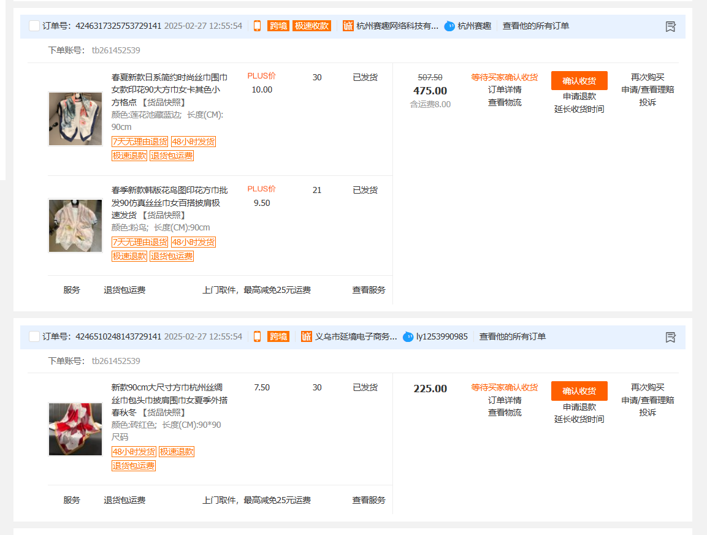

# Introduction

### About the project
This project focuses on analyzing order trends and volume over time for **Leuleu Accessorize**, a growing jewelry and accessories brand in Vietnam. The goal is to provide data-driven insights to support decision-making and improve inventory and supplier management. Through in-depth analysis and recommendations, this project aims to help the business optimize its ordering process and enhance transparency in inventory tracking.

### Case Study: Leuleu Accessorize
Founded in 2014, Leuleu Accessorize began as a small boutique offering **affordable, stylish, and trendy jewelry**. Over the years, it expanded rapidly, adding new product lines such as Leuleu Lingerie and Leuleu Aeon Mall Shop. However, with this growth came operational challenges, particularly in inventory and supplier management.

#### The Business Challenge

In 2021, Leuleu Accessorize adopted its **first CRM system**, integrating multiple data sources to streamline operations. However, supplier-related data from Chinese manufacturers was not included in the system. As a result:

- Key details like **order id, total paid for each order, total items, and supplier information were missing**.
- Inventory records only tracked item counts without recording their costs, making it difficult to determine **total inventory value**.
- The lack of order-level transparency created difficulties in **tracing orders, managing suppliers, and assessing stock valuation**.

To address these issues, my primary tasks in this project include:

- **Extracting and consolidating a dataset containing detailed order records** from 2022 onwards, including order number, import dates, prices and quantities of items within each order, total paid before and after discount, and supplier details.
- **Performing order trend and volume analysis** to uncover actionable insights.

### Techniques Used
To accomplish the project goals, the following tools and techniques were utilized:
- **Web Scraping with Python**: 
    - Extracted all order data from 1688, a Chinese E-commerce platform spanning 2022 to 2025 using **BeautifulSoup**
    - Used **Selenium** to navigate challenges like lack of APIs, CAPTCHA restrictions, and dynamic content loading.
- **Data Cleaning & EDA with MySQL**: Processed and cleaned raw data using MySQL, handling duplicates and exploring insights about order trends and patterns.
- **Data Visualization with Power BI**: Designed interactive dashboards to visualize order trends and volume fluctuations, provising actionable insights to enhance decision-making in inventory and supplier management.

# Web Scraping with Python 🕸️

