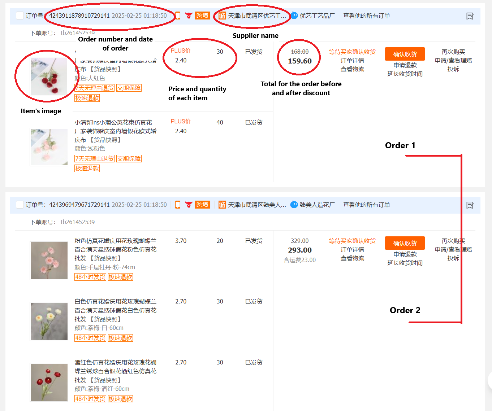

# Introduction

### About the project
This project focuses on analyzing order trends and volume over time for **Leuleu Accessorize**, a growing jewellry and accessories brand in Vietnam. The goal is to provide data-driven insights to **support decision-making** and **improve inventory and supplier management**. Through in-depth analysis and recommendations, this project aims to help the business **optimize its ordering process and enhance transparency in inventory tracking**.

Beyond the technical aspects, this project is especially meaningful to me because it allows me to help my sister, the business owner, navigate the world of digital transformation. Before this, she managed her business without leveraging data, unaware of how data analytics could significantly improve her operations. By introducing her to data-driven decision-making, I am not only helping her solve existing business challenges but also demonstrating **the power of analytics in real-world applications**—a passion that drives my work as a data analyst.

### Case Study: Leuleu Accessorize
Founded in 2014, Leuleu Accessorize began as a small boutique offering **affordable, stylish, and trendy jewellry**. Over the years, it expanded rapidly, adding new product lines such as Leuleu Lingerie and Leuleu Aeon Mall Shop. However, with this growth came operational challenges, particularly in inventory and supplier management.

#### The Business Challenge

In 2021, Leuleu Accessorize adopted its **first CRM system**, integrating multiple data sources to streamline operations. However, supplier-related data from Chinese manufacturers was not included in the system. As a result:

- Key details like **order id, total paid for each order, total items, and supplier information were missing**.
- Inventory records only tracked item counts without recording their costs, making it difficult to determine **total inventory value**.
- The lack of order-level transparency created difficulties in **tracing orders, managing suppliers, and assessing stock valuation**.

To address these issues, my primary tasks in this project include:

- **Extracting and consolidating a dataset containing detailed order records** from 2022 onwards, including order number, import dates, prices and quantities of items within each order, total paid before and after discount of each order, and relevant supplier details.
- **Performing order trend and volume analysis** to uncover actionable insights.

This project has been an incredible opportunity to apply my data analysis skills to a real-world business while directly helping my sister transform her business operations. It also strengthens my expertise in data extraction, analysis, and visualization, which are essential skills in my career as a data analyst.

### Techniques Used
To accomplish the project goals, the following tools and techniques were utilized:
- **Web Scraping with Python**: 
    - Extracted all order data from **1688**, a Chinese E-commerce platform spanning 2022 to 2025 using **BeautifulSoup**
    - Used **Selenium** to navigate challenges like lack of APIs, CAPTCHA restrictions, and dynamic content loading.
- **Data Cleaning & EDA with MySQL**: Processed, cleaned raw data using MySQL, and explored insights about order trends and spending patterns.
- **Data Visualization with Power BI**: Designed interactive dashboards to visualize order trends and volume fluctuations, providing actionable insights to enhance decision-making in inventory and supplier management.

# Web Scraping with Python 🕸️

Before scraping the data, it's essential to understand the structure of the 1688 webpage and how the information is displayed in the order list:

 


### Inspecting and Locating Key Data Points

To extract relevant details such as order number and supplier name, I used the browser’s Inspect Tool (press F12) to analyze the page’s HTML structure. This helps identify the exact elements where the data is stored. 

### Scraping Data with BeautifulSoup

Once the key elements are located, I used BeautifulSoup to parse the HTML and extract the required information into a structured dataset. The [Local_file_scraping.ipynb](code/Local_file_scraping.ipynb) notebook demonstrates the full implementation, where it loops through each order to extract its details.

At this stage, I was testing the script with a local HTML file to ensure the extraction logic works correctly before applying it to the live website. 


<figcaption>The CSV file of the output</figcaption>

\
The saved file now contains the following attributes, which represent for each item: 
- ***order_id***
- ***date***
- ***supplier*** 
- ***supplier_link***
- ***image*** (which is saved as the url link to the image of each product)
- ***product_link*** 
- ***price*** and ***quantity***
- ***total_before_discount*** and ***total_after_discount***.


### Scraping Data from the Live Website

After successfully testing our code on a local HTML file, we can now run it on the live 1688 website. This requires **Selenium**, a Python package used for automating web interactions.

The key difference between scraping from a local file versus a live website is the need to:

- Log in manually to bypass **CAPTCHA**.
- **Implement pagination** so the script can loop through multiple pages (from page 1 to 68, covering orders dating back to 2022), which can be done by adding 1 more loop to the current code.

By incorporating these adjustments, we can extract all order details efficiently and store them in a structured dataset. The [Live_website_scraping](code/Live_website_scraping.ipynb) notebook shows how I addressed these tasks and import the extracted data into a [final CSV file](code/all_orders_2022_2025.csv), which has more than 24,000 rows, or unique items without their quantities.

*Note: To protect the privacy of order details and supplier information, **certain columns have been removed**.

# Data Cleaning & EDA with MySQL

The current dataset, which can be imported into MySQL using [all_orders_database_import.sql](code/all_orders_database_import.sql) contains some null values in the ***total_before_discount*** column. This occurs because certain orders did not receive any discounts, meaning the final price was directly stored in ***total_after_discount***. To ensure consistency, we can update ***total_before_discount*** to ***match total_after_discount*** for these cases:

```SQL
UPDATE all_orders
SET total_before_discount = total_after_discount
WHERE total_before_discount IS NULL;
```

To improve tracking and data integrity, I have added ***id*** and ***supplier_id*** columns, serving as unique identifiers for each item and supplier, respectively. 

```SQL
-- Add supplier id
ALTER TABLE all_orders
ADD COLUMN supplier_id INT; -- This column will initially have NULL values for all rows

-- Assign supplier_id to each supplier
UPDATE all_orders a
JOIN (
    SELECT supplier, 
    DENSE_RANK() OVER (ORDER BY supplier) AS rank_id -- Assigns a unique number to each supplier unique number
    FROM all_orders
) ranked ON a.supplier = ranked.supplier
SET a.supplier_id = ranked.rank_id;
```

### Analyzing Trends with SQL

**MySQL** is a powerful tool for uncovering trends and insights in the dataset. The [SQL_EDA.sql](code/SQL_EDA.sql) file contains 12 querries designed to analyze various aspects of order trends and spending behavior. These queries help the business owner gain valuable insights, such as:

```SQL
-- How often do I place orders on monthly average
WITH total_months_each_year AS (
	SELECT 
		YEAR(date) AS year, 
		COUNT(DISTINCT MONTH(date))  AS total_month
    FROM all_orders 
    GROUP BY YEAR(date)
    )
, total_orders_each_year AS (
	SELECT
		COUNT(DISTINCT order_id) as total_orders,
		YEAR(date) as year
	FROM all_orders
	GROUP BY 2
    )
SELECT 
	t1.year,
    t1.total_month,
    t2.total_orders,
    t2.total_orders/t1.total_month AS AVG_order_permonth
FROM total_months_each_year t1
JOIN total_orders_each_year t2 ON t1.year = t2.year
ORDER BY 1;
```
The result will be as following:

| Year | Total Months | Total Orders | Avg Orders per Month |
|------|-------------|--------------|----------------------|
| 2022 | 9           | 398          | 44.2222              |
| 2023 | 12          | 812          | 67.6667              |
| 2024 | 12          | 1282         | 106.8333             |
| 2025 | 2           | 106          | 53.0000              |

Or knowing the longest gap between orders, which is **35 days**:

```SQL
-- What is the longest gap between orders?
WITH CTE AS (
	SELECT DISTINCT order_id, date FROM all_orders 
)
SELECT
    date,
    LAG(date, 1, 0) OVER(ORDER BY date) AS last_order_day,
    DATEDIFF(date, LAG(date, 1, 0) OVER(ORDER BY date)) AS day_gap
FROM CTE
ORDER BY 3 DESC
LIMIT 5;
```

| Date       | Last Order Day | Day Gap|
|------------|--------------|--------|
| 2023-02-07 | 2023-01-03   | 35     |
| 2025-02-07 | 2025-01-15   | 23     |
| 2024-02-20 | 2024-01-29   | 22     |
| 2024-08-23 | 2024-08-09   | 14     |
| 2022-09-04 | 2022-08-22   | 13     |

Or having an **order summary** from all the suppliers:

| Supplier ID | Supplier Name                          | Total Orders | Total Items | Total Spent | Total Discount |
|------------|--------------------------------------|--------------|-------------|-------------|----------------|
| 528        | 义乌市韩爵饰品厂                     | 67           | 19855        | 74709.26    | 1096.23        |
| 215        | 义乌市宝钰饰品有限公司               | 35           | 5275         | 36951.65    | 212.51         |
| 265        | 义乌市悦楠服饰有限公司               | 35           | 11982         | 81172.16    | 1968.20        |
| 69         | 临海市梦纤语服装加工厂               | 27           | 1318         | 85777.35    | 0.00           |
| 97         | 义乌市紧铭电子商务有限公司           | 25           | 520         | 11949.90    | 2.10           |

# Data Visualization with Power BI

MySQL provides valuable insights, but visualizing the data makes it even more powerful and actionable. By connecting the MySQL server to Power BI and importing the dataset, I built an interactive dashboard that highlights key trends in order volume and spending. This dashboard offers a clear, data-driven view of the business's purchasing patterns, making it easier to identify opportunities for optimization.

You can download the Power BI dashboard [here](code/LeuleuReport.pbix):


#### Seasonality and Order Volume Trends
- Overall, the business has spent around ¥3.7M (more than AUD $800,000) during the given period, purchasing 581,000 items across 2,598 orders.
- **Order Seasonality**: In 2023 and 2024 (excluding 2022 and 2025 due to incomplete data), the highest order volumes were observed in May (219 orders), July (213 orders), and October (238 orders). This suggests a seasonal purchasing pattern, likely driven by preparations for peak demand periods, such as **summer** and **winter**.
- Notably, order volumes tend to **drop immediately after high-order months**, indicating that stock purchased during peak months sustains operations for the following 1-2 months before replenishment is needed. This pattern highlights an efficient inventory turnover cycle, ensuring stock availability while preventing overstocking.

#### Spending behavior & Pricing Strategy
- Despite total spending being the same for **2023 and 2024, around ¥1,5M**, the number of orders increased by 470 in 2024, suggesting a shift toward **lower-cost items** or **smaller, more frequent purchases**.  
- Additionally, the **average spending per order** has steadily decreased, from ¥1,818 in 2022 to ¥872 in 2025. This trend suggests that the business is either adopting a lower pricing strategy or increasing order frequency while reducing the number of items per order. 
- The **Monthly Volume of Orders chart** supports this observation, showing that while **average items per order have declined each year, average orders per month have significantly increased** (except for 2025, which currently only includes January—a historically low-order month).
- The **Supplier Summary Table** provides insights into this strategy. The number of suppliers increased from **186 in 2022 to 325 in 2023, and 610 in 2024—a 200% annual growth rate**. This suggests the business is actively **sourcing from more suppliers** to **diversify its product offerings**, leading to an increase in order frequency while reducing the quantity per order.

     
     <figcaption>Bar chart demonstrating the number of suppliers per year</figcaption>

#### Supplier performance
- Discounts were **nonexistent in 2022-2023 (0%)** but rose to **2% in 2024 and 7% in 2025**, indicating a **more aggressive discounting strategy in recent years**.
- Despite the increase, the **total discount across all orders was only ¥36,563**, accounting for **less than 1%** of total spending—suggesting discounts **have not played a major role in cost reduction**.
- Suppliers **126 and 69** contributed the **highest spending (~¥90,000 each)** but **offered no discounts** at any time, which might indicate **strong demand for their products** or **a lack of price negotiations**.
- Some suppliers provided significant discounts, possibly reflecting **bulk purchase deals or promotional offers**. This suggests that strategic supplier selection could further optimize costs if better discount opportunities are explored.

### Potential Business Action

 #### 1. Optimize Inventory Management & Forecasting
- **Action**: Leverage seasonal order trends (peaks in March, July, and October) to anticipate demand and adjust stock levels accordingly. This will prevent stockouts during peak periods while avoiding excess inventory in low-demand months.
- **Implementation**: 
  - Use historical sales data to build a predictive demand model
  - Implement an automated reorder system to replenish stock efficiently.

#### 2. Improve Cost Efficiency Through Supplier Negotiation
- **Action**: Negotiate better discounts with high-spend suppliers (e.g., Supplier 126 & 69) who currently offer no discounts.This is because even a small discount (e.g., 5%) on these major suppliers could result in significant cost savings.
- **Implementation**: 
  - Group purchases with selected suppliers to qualify for bulk discounts.
  - Explore alternative suppliers who offer similar products at lower prices.

#### 3. Refine Pricing & Order Strategy
- **Action**: Analyze the profitability of the lower-priced, high-frequency order strategy to ensure margins are sustainable. This is because the trend of more frequent, smaller orders suggests a shift in strategy, but it may increase operational costs (e.g., logistics, handling).
- **Implementation**:
  - Conduct a cost-benefit analysis to compare bulk vs. frequent ordering.
  - If feasible, consolidate smaller orders to reduce costs.

#### 4. Streamline Supplier Base & Sourcing Strategy
- **Action**: Assess whether expanding the supplier base from 186 (2022) to 610 (2024) is beneficial or leading to inefficiencies as too many suppliers can increase complexity and procurement costs.
- **Implementation**:
  - Identify underperforming suppliers and consolidate orders with the most reliable ones.
  - Establish long-term partnerships with key suppliers to secure better terms & pricing.

#### 5. Implement Data-Driven Order Timing
- **Action**: Encourage ordering in low-demand months to balance workload & reduce peak-season pricing risks. Additionally, suppliers may offer better prices during off-peak months.
- **Implementation**:
  - Analyze past pricing trends to determine the best months for placing orders.
  - Plan early purchases for high-demand months to avoid last-minute price surges

#### Key Takeaways:
- ✅ Optimize stock replenishment based on seasonal trends.
- ✅ Negotiate better supplier terms for high-spend suppliers.
- ✅ Assess whether frequent small orders are more cost-effective than bulk purchases.
- ✅ Evaluate supplier expansion efficiency vs. complexity.
- ✅ Use data-driven purchasing to secure better pricing and order timing


# Challenges during the Project
Before this project, my experience with web scraping and Python coding was limited. However, with a strong motivation to support my sister’s business, I conducted extensive research on automating data collection from web pages. While AI tools like ChatGPT provided valuable assistance, this project could not have been completed without human intervention. Debugging, understanding how the code works in different scenarios, and adapting AI-generated code to fit specific requirements required **critical thinking and problem-solving skills**. I believe that **levaraging AI alongside human domain and expertise** enhances project outcomes, making it a powerfull skill for any professional nowadays.

Another significant challenge was that the target webpage was written in Chinese, making it difficult for me to understand its structure and locate key data points. Over time, this became easier as I collaborated with the **inventory team at Leuleu Accessorize**, whose insights helped me navigate the data more effectively. 

Despite these challenges, I gained **valuable new skills** and discovered different approaches to problem-solving. This project was a **real-world experience** where I acted as a data analyst, helping a business owner gain insights into **order trends and volume** while demonstrating the importance of **data analytics in business operations and decision-making**. Most importantly, it was personally meaningful to support my sister in taking her **first step toward digital transformation**, reinforcing the impact that data-driven strategies can have on small businesses.

# Conclusion

This project provided a valuable hands-on experience in web scraping, data analysis, and problem-solving while supporting a real business need. Overcoming challenges such as language barriers and debugging code deepened my understanding of data automation and its role in business decision-making. More importantly, it highlighted the power of combining AI tools with human expertise to drive efficiency. By successfully delivering insights into order trends and volume, this project marked an important step toward digital transformation for my sister’s business, reinforcing the impact of data-driven strategies in modern business operations.

